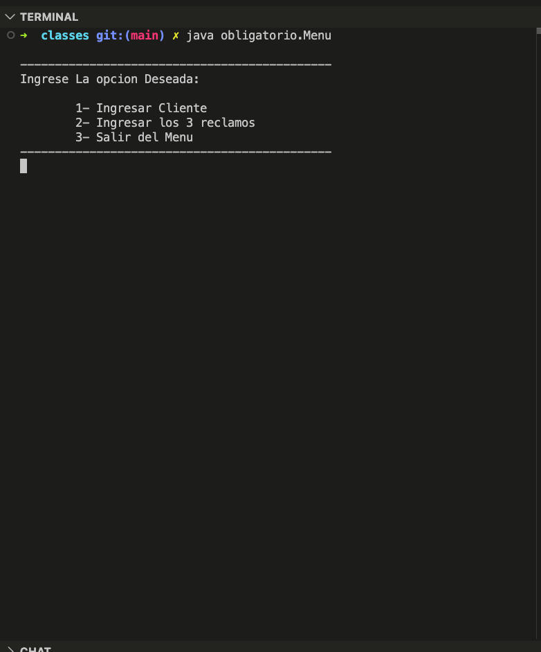
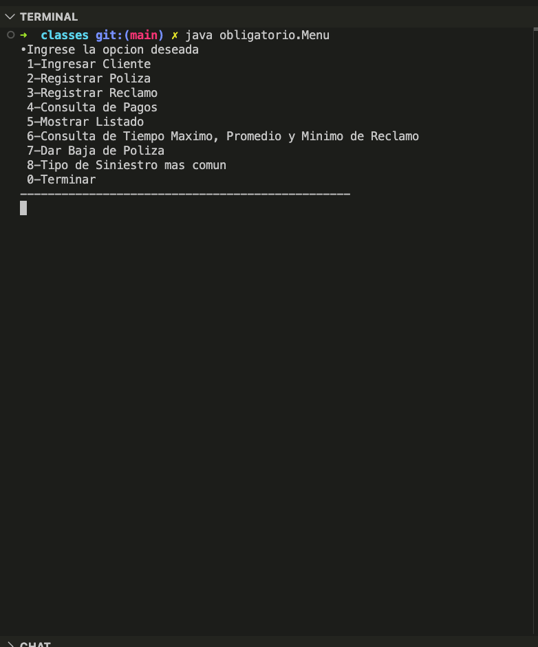
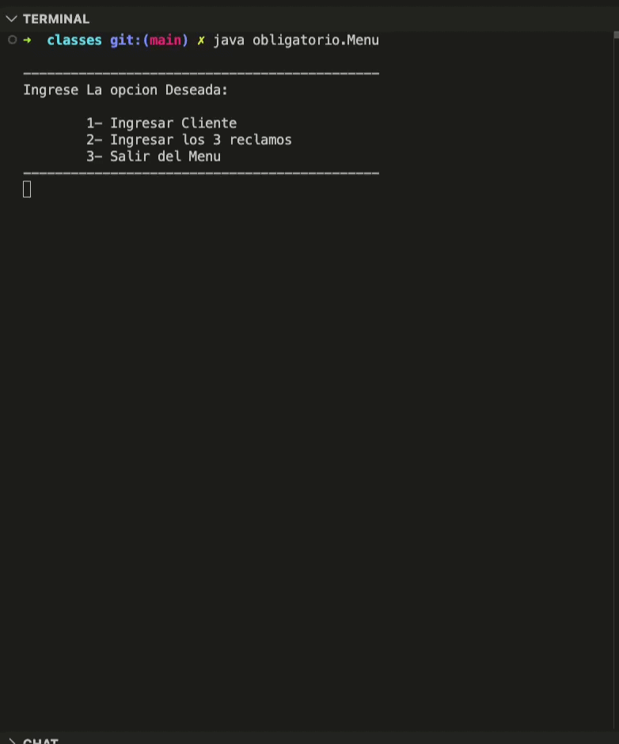

# Insurance Management System ☂️

This repository contains my university project from **2010**, developed as part of my first programming course. It was submitted in **two parts** and built entirely in **Java**, with no frameworks or external libraries — just core Java and the standard library.

> 📋 The project was an academic assignment and is included here as a record of where I started as a developer.

> 👥 Built in collaboration with **Tomas Gallo**.

## Running the Project

1. Clone the repository.

2. Make sure you have **Java** installed. Any version from Java 8 onwards works.
   You can download it from [adoptium.net](https://adoptium.net).

3. Navigate to the part you want to run and compile the source files:

    ```bash
    cd part-1/src
    javac obligatorio/*.java -d ../out
    # or
    cd part-2/src
    javac obligatorio/*.java -d ../out
    ```

4. Run the program:

    ```bash
    cd ../out
    java obligatorio.Menu
    ```

## Overview

A console-based insurance management system where users can register clients, policies, and claims, and run queries on the data. The project was split into two deliveries, each building on the previous one.

**Part 1** focused on the core data entry flow — entering a client, linking a policy, and registering three claims. All data was held in local variables within a single session.

**Part 2** expanded the system significantly, replacing fixed variables with `ArrayList` collections, introducing a proper class hierarchy, and adding features like listing records, policy cancellation, and claim time statistics.

## Features

**Part 1:**
- ☑️ Register a client
- 📋 Link a policy to the client
- 📝 Enter three claims against the policy
- 🔍 Query payments by month, year, and policy type
- 📊 Identify the most common claim type (theft vs. collision)

**Part 2:**
- ☑️ Register multiple clients (stored in a list)
- 📋 Register multiple policies and claims
- 📝 Cancel (deregister) a policy
- 🔍 Payment consultation
- 📊 Most common claim type across all records
- ⏱️ Min, max, and average claim resolution time
- 👤 Client types: Personal and Empresarial (inheritance)

## Technologies


- **Java** — Core language, standard library only
- **NetBeans** — IDE used at the time of development

## What I would do differently today

Looking back at this code after 15+ years, a few things stand out:

- Add unit tests
- Separate data, logic, and UI into proper layers (MVC)
- Use interfaces and generics more deliberately
- Build a proper UI — something we learned in the following course, Programación II
- Handle exceptions instead of assuming valid input

## Preview

### Screenshots




### Gif 
